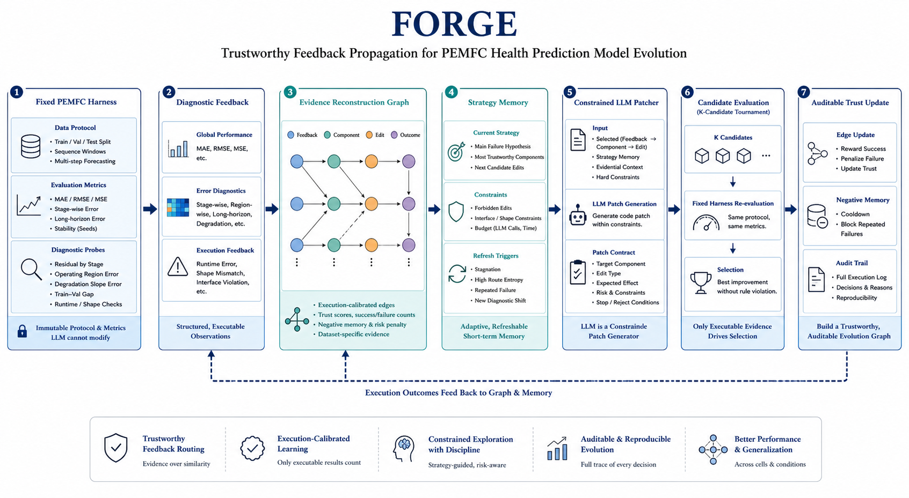

# FORGE

**Feedback Observability-guided Routing for Graph-based Evolution**

FORGE is a runnable research system for self-improving PEMFC health prediction.
It studies how an LLM agent can refine forecasting model code under a fixed
experimental harness without freely rewriting the task protocol. The central
state is an execution-calibrated evidence graph: diagnostic feedback is routed
to model components only through relations supported by observed error
correction, and each accepted or rejected edit is preserved as an auditable
model-improvement trace.



## Core Idea

FORGE separates model evolution into four stable modules:

1. **PEMFC-native diagnostic harness**: fixed dataset loading, chronological
   split, training, validation, testing, metrics, logs, train/validation curves,
   residual probes, and invalid-patch detection.
2. **Evidence-calibrated routing graph**: diagnostic feedback, model components,
   edit operators, and execution outcomes are represented as graph nodes.
   Feedback routing is calibrated by executable outcomes rather than semantic
   similarity or LLM confidence.
3. **Accepted-parent selection with negative evidence suppression**: failed or
   regressive patches still update evidence memory, but only accepted or
   protected-best models can become the next parent.
4. **Auditable trajectory**: each round records the diagnostic feedback, routed
   relation, LLM patch or fallback, harness result, metric delta, trust update,
   and accept/reject decision.

The LLM is used as a constrained patch generator. It receives structured
harness evidence and a routed edit scope, proposes local model code changes,
and is overruled by validation, execution, and non-regression checks.

## Repository Layout

```text
configs/                 Experiment, harness, routing, and trust policies
docs/figures/            README and paper-style figures
forge/                   FORGE runtime, harness bridge, routing, CLI
prompts/                 LLM prompts for model patching and evidence summary
runs/                    Experiment outputs
skills/                  Reusable model templates and validated repair patches
tests/                   Unit tests
workspace/               Saved initial model entry point
```

## Quick Start

Initialize local folders and extract the PEMFC CSV files when needed:

```bash
python -m forge.cli init
```

Run a short smoke test without calling the LLM:

```bash
python -m forge.cli run --rounds 1 --epochs 5 --batch-size 64 --llm-mode off
```

`--llm-mode off` is reserved for harness smoke checks. Official model-evolution runs
should use `--llm-mode required`.

Select dataset, history length, and prediction horizon explicitly:

```bash
python -m forge.cli run --data FC1 --seq-len 96 --pred-len 12
python -m forge.cli run --data FC2 --seq-len 24 --pred-len 6
```

Choose GPU or CPU:

```bash
python -m forge.cli run --device cuda --cuda-id 1
python -m forge.cli run --device cpu
```

The LLM configuration is stored in `configs/forge_llm.yaml`.

## Recommended Experiment Workflow

The recommended stable protocol is:

1. Run each dataset independently for 20 rounds.
2. Inspect `best_iteration`, benchmark-scaled MAE/MSE, improvement percentage,
   and `evidence_audit`.
3. Continue the same run by 10 rounds if the best model appears near the last
   iteration or the evidence audit still shows useful improvements.
4. Use `--parent-policy best` so unsuccessful exploratory edits update memory without
   becoming the next parent model.

Start a fresh FC1 run:

```bash
python -m forge.cli run \
  --data FC1 \
  --seq-len 24 \
  --pred-len 12 \
  --rounds 20 \
  --epochs 200 \
  --llm-mode required \
  --routing-mode trust \
  --parent-policy best \
  --candidate-tournament-k 1 \
  --final-summary true \
  --dispatch-mode synthesis \
  --dispatch-candidates 2 \
  --dispatch-llm-mode required \
  --archive-candidates 0 \
  --device cuda \
  --cuda-id 0 \
  --run-name pilot_trust_summary_FC1_L24_P12_R20
```

Start a fresh FC2 run:

```bash
python -m forge.cli run \
  --data FC2 \
  --seq-len 24 \
  --pred-len 12 \
  --rounds 20 \
  --epochs 200 \
  --llm-mode required \
  --routing-mode trust \
  --parent-policy best \
  --candidate-tournament-k 1 \
  --final-summary true \
  --dispatch-mode synthesis \
  --dispatch-candidates 2 \
  --dispatch-llm-mode required \
  --archive-candidates 0 \
  --device cuda \
  --cuda-id 0 \
  --run-name pilot_trust_summary_FC2_L24_P12_R20
```

Continue an existing FC1 run by 10 rounds:

```bash
python -m forge.cli continue \
  --run-dir runs/<printed_FC1_run_dir> \
  --additional-rounds 10 \
  --epochs 200 \
  --llm-mode required \
  --routing-mode trust \
  --parent-policy best \
  --candidate-tournament-k 1 \
  --final-summary true \
  --dispatch-mode synthesis \
  --dispatch-candidates 2 \
  --dispatch-llm-mode required \
  --archive-candidates 0 \
  --device cuda \
  --cuda-id 0
```

Continue an existing FC2 run by 10 rounds:

```bash
python -m forge.cli continue \
  --run-dir runs/<printed_FC2_run_dir> \
  --additional-rounds 10 \
  --epochs 200 \
  --llm-mode required \
  --routing-mode trust \
  --parent-policy best \
  --candidate-tournament-k 1 \
  --final-summary true \
  --dispatch-mode synthesis \
  --dispatch-candidates 2 \
  --dispatch-llm-mode required \
  --archive-candidates 0 \
  --device cuda \
  --cuda-id 0
```

Continue to an absolute final iteration index:

```bash
python -m forge.cli continue \
  --run-dir runs/<printed_FC1_run_dir> \
  --to-round 50 \
  --epochs 200 \
  --llm-mode required \
  --routing-mode trust \
  --parent-policy best \
  --candidate-tournament-k 1 \
  --final-summary true \
  --dispatch-mode synthesis \
  --dispatch-candidates 2 \
  --dispatch-llm-mode required \
  --archive-candidates 0 \
  --device cuda \
  --cuda-id 0
```

Refresh one completed run without training:

```bash
python -m forge.cli summarize-run --run-dir runs/<printed_FC1_run_dir>
```

The summary prints the global best model from `iter_000` to the current maximum
iteration, plus the improvement percentage against the configured reference
target and a concise evidence table:

```text
[FORGE] FORGE best: iter_016 MAE=4.2593 MSE=8.9407
[FORGE] FORGE vs reference target: improvement over reference target MAE=10.52% MSE=6.77%
[FORGE] Concise evidence summary
+----------------------------+--------------------------------------+
| Item                       | Value                                |
+----------------------------+--------------------------------------+
| Target best                | iter_016: MAE 4.2593, MSE 8.9407     |
| MAE-best                   | iter_016: MAE 4.2593 (10.52%), ...   |
| MSE-best                   | iter_016: MAE 4.2593, MSE 8.9407     |
| Joint-best                 | iter_016: MAE 4.2593, MSE 8.9407     |
| Protected best model       | iter_016 (MAE 4.2593, MSE 8.9407)    |
| Dispatch winner            | synthesis candidate_00 won (...)     |
| Final selection policy     | auto / target_best                   |
| Improvement rate           | 22.50%                               |
| Invalid edit rate          | 12.50%                               |
| Routing stability          | 61.88%                               |
| Evidence alignment         | 100.00%                              |
| Top trusted components     | temporal_memory(4/23), ...           |
+----------------------------+--------------------------------------+
```

The improvement percentage is `(reference_target - FORGE) / reference_target *
100`. Positive means FORGE is better; negative means it is worse.
`Best iteration` follows the configured target metric, while `Final selected
model` is metric-aware. With the default `--final-selection-policy auto`, FORGE
keeps the target-metric best only when both benchmark-scaled MAE and MSE are
non-regressive; otherwise it selects the best available joint MAE/MSE model
without changing the already completed search trajectory.

## Command Modes

- `run`: starts a new independent experiment. Use a fresh `--run-name` or an
  empty `--run-dir`.
- `continue`: extends an existing run while preserving graph memory, model
  versions, feedback vectors, routing records, and patch artifacts. It uses the
  supplied `--run-dir` directly; summaries compute the true maximum iteration
  from saved `iter_*` folders even if an older directory name contains `R20`,
  `R50`, or another stale label.
- `sweep`: creates one child run per dataset/history/horizon combination.
- `summarize-run`: refreshes one run summary without training or LLM calls.
- `summarize-sweep`: refreshes a sweep-level summary from child summaries.
- `dispatch`: runs the final evidence synthesis or report stage over a completed run.

## Parameter Reference

| Parameter | Values / Range | Recommended | Meaning |
| --- | --- | --- | --- |
| `--data` | `FC1`, `FC2` | run both separately | PEMFC dataset/cell. |
| `--seq-len` | `12`, `24`, `48`, `96`, `192` | `24` for pilot | Historical input length. |
| `--pred-len` | `1`, `3`, `6`, `12` | `12` for L24-P12 | Forecast horizon. |
| `--rounds` | integer `>=0` | `20` first | For `run`; `--rounds 20` evaluates `iter_000` through `iter_020`. |
| `--additional-rounds` | integer `>0` | `10` | For `continue`; add this many iterations after the current last iteration. |
| `--to-round` | integer greater than current last iteration | `50` for long runs | For `continue`; absolute final iteration index. |
| `--epochs` | integer `>0` | `200` official, `5` smoke | Max training epochs per harness run. |
| `--batch-size` | integer `>0` | `128` | Training batch size. |
| `--lr` | float `>0` | `0.001` | Learning rate. |
| `--patience` | integer `>0` | `5` | Early-stopping patience. |
| `--seed` | integer | `2025` | Random seed. |
| `--device` | `cuda`, `cpu`, `auto` | `cuda` | Runtime device. |
| `--cuda-id` | visible CUDA index | `0` | GPU id when using CUDA. |
| `--llm-mode` | `required`, `auto`, `off` | `required` official | LLM patch mode. |
| `--routing-mode` | `trust`, `prior`, `rule`, `trust-action` | `trust` | Feedback routing policy. |
| `--parent-policy` | `best`, `last` | `best` | Parent model selection. |
| `--candidate-tournament-k` | stable setting: `1` | `1` | Stable FORGE executes one evidence-routed candidate per round. |
| `--final-selection-policy` | `auto`, `target`, `joint`, `balanced` | `auto` | Non-destructive final model selector. `auto` keeps target best when MAE/MSE both improve, otherwise selects a joint MAE+MSE non-regressive model if available. It does not change the iteration search. |
| `--final-summary` | `true`, `false` | `true` for official runs | Explicit switch for the final evidence stage. Works for both fresh `run` and resumed `continue`; `false` skips the final stage. |
| `--final-dispatch` | flag | compatible alias | Compatibility flag that enables the same final stage; `--final-summary true/false` is clearer and overrides it when set. |
| `--dispatch-mode` | `synthesis`, `summary`, `candidates` | `synthesis` | Optional final evidence stage. `synthesis` tries guarded fragment transplant from successful trajectory evidence; `summary` writes an audit report; `candidates` runs a motif-transplant comparison mode. |
| `--dispatch-candidates` | integer `>=0` | `2` for synthesis, `4` for candidates, `0` for summary | Total final-stage candidate budget. Keep synthesis small in the stable protocol; larger values are best treated as explicit ablations. |
| `--dispatch-llm-mode` | `required`, `auto`, `off` | `required` | LLM mode for final evidence synthesis. |
| `--archive-candidates` | integer `>=0` | `0` | Historical model promotion candidates; keep `0` for the main method. |
| `--run-name` | string | descriptive name | Creates a normalized new run directory under `runs/`. FORGE strips an existing trailing timestamp, rewrites stale or malformed round suffixes such as `_R10` or `_R1-0` to the actual `--rounds` value, and appends a fresh `_MMDDHHMM` timestamp. |
| `--run-dir` | path | existing path for `continue` | Existing run directory for continuation or refresh. |
| `--scaling` | `baseline`, `train` | `baseline` | Scaling protocol. Keep the default for benchmark-compatible reporting. |
| `--limit-rows` | integer or omitted | omit | Development-time row limit for fast harness checks. |

## When To Continue

Continue by 10 rounds if one of these is true:

- `best_iteration` is equal to the current last iteration.
- `best_iteration` is within the last 3-5 iterations.
- `evidence_audit.metrics.improvement_rate` is still nonzero.
- The latest summary still has below-target improvement percentage against the
  configured reference target on the metric you care about.

Stop or switch to another seed/run if:

- the best iteration is far behind the current last iteration,
- repeated useless edit rate keeps rising,
- invalid edit rate is high,
- or several continuations do not improve benchmark-scaled MAE/MSE.

## Evidence Dispatch

Evidence Dispatch is an optional final-stage audit or guarded synthesis step,
not the main optimization engine. The main method is the probing trajectory
driven by trust routing, accepted-parent selection, and negative evidence
suppression. When synthesis is enabled, FORGE triages the completed trajectory
into protected best, MAE-best, MSE-best, joint-best, and recent effective
improvement records. The LLM may adapt a small number of successful fragments
onto the protected best prefix; every candidate is evaluated under the same
fixed harness and accepted only when it improves on the protected best without
MAE/MSE regression. If no synthesis candidate passes, the protected best remains
final.

```bash
python -m forge.cli dispatch \
  --run-dir runs/<run_name> \
  --llm-mode required \
  --dispatch-mode synthesis \
  --dispatch-candidates 2 \
  --evidence-scope current-run \
  --archive-candidates 0 \
  --target-diagnostics long_horizon_error residual_autocorrelation residual_drift \
  --device cuda \
  --cuda-id 0
```

The dispatch artifact is saved under `runs/<run_name>/evidence_dispatch*/` with
`protected_best/`, `final/`, `dispatch_payload.json`, `dispatch_report.json`,
and `dispatch_summary.json`.

Report dispatch is available for audit refreshes:

```bash
python -m forge.cli dispatch \
  --run-dir runs/<run_name> \
  --llm-mode required \
  --dispatch-mode summary
```

Candidate-based motif dispatch is available as a comparison mode:

```bash
python -m forge.cli dispatch \
  --run-dir runs/<run_name> \
  --llm-mode required \
  --dispatch-mode candidates \
  --dispatch-candidates 4 \
  --archive-candidates 0
```

## Trust Routing And Ablations

The stable method uses `trust` routing:

- `trust`: main method. Diagnostic feedback propagates through learned
  feedback-component relations, and those relations are updated by executable
  outcomes.

The following modes are retained for controlled comparisons and future work:

- `trust-action`: experimental setting for relation-level action memory,
  attention gates, adaptive temperature, and structural operator experiments.
- `prior`: fixed PEMFC priors without outcome-based trust updates.
- `rule`: baseline rule routing without diagnostic trust propagation.

Focused two-dataset pilot:

```bash
python -m forge.cli sweep \
  --datasets FC1 FC2 \
  --seq-lens 24 \
  --pred-lens 12 \
  --rounds 10 \
  --epochs 200 \
  --llm-mode required \
  --routing-mode trust \
  --parent-policy best \
  --run-name pilot_trust_FC1_FC2_L24_P12_R10
```

Comparison controls:

```bash
python -m forge.cli sweep --datasets FC1 FC2 --seq-lens 24 --pred-lens 12 --rounds 10 --epochs 200 --llm-mode required --routing-mode rule --parent-policy best --run-name ablate_rule_FC1_FC2_L24_P12_R10
python -m forge.cli sweep --datasets FC1 FC2 --seq-lens 24 --pred-lens 12 --rounds 10 --epochs 200 --llm-mode required --routing-mode prior --parent-policy best --run-name ablate_prior_FC1_FC2_L24_P12_R10
python -m forge.cli sweep --datasets FC1 FC2 --seq-lens 24 --pred-lens 12 --rounds 10 --epochs 200 --llm-mode required --routing-mode trust-action --parent-policy best --run-name ablate_trust_action_FC1_FC2_L24_P12_R10
```

## Benchmark Grid

The benchmark grid is configured in `configs/harness/benchmark_grid.yaml`:

- datasets: `FC1`, `FC2`
- historical lengths: `12, 24, 48, 96, 192`
- prediction lengths: `1, 3, 6, 12`

Run the full configured grid:

```bash
python -m forge.cli sweep --rounds 1 --epochs 200 --llm-mode required
```

Run a focused subset:

```bash
python -m forge.cli sweep --datasets FC1 FC2 --seq-lens 24 48 --pred-lens 6 12 --epochs 20 --llm-mode required
```

Sweep outputs are saved under `runs/<sweep_name>/` as `sweep_summary.json` and
`sweep_summary.csv`, with each combination stored in its own run directory.

## Flexible Harness Files

Most protocol constants live outside Python:

- `configs/harness/pemfc_harness.yaml`: datasets, feature columns, split ratios, model interface
- `configs/harness/benchmark_grid.yaml`: dataset/history/horizon benchmark combinations
- `configs/harness/feedback_schema.yaml`: feedback vector schema
- `configs/harness/routing_graph.yaml`: component graph
- `configs/harness/routing_policy.yaml`: routing thresholds, weights, and reason text
- `configs/harness/trust_policy.yaml`: diagnostic-component priors and executable outcome trust updates
- `configs/harness/heuristic_patches.yaml`: component-to-template repair mapping
- `skills/forge_model_templates/`: complete repair model templates
- `prompts/model_patch.yaml`: LLM patch prompt
- `prompts/evidence_summary.yaml`: report-mode evidence dispatch prompt
- `prompts/evidence_synthesis.yaml`: outcome-calibrated trace synthesis prompt
- `prompts/evidence_dispatch.yaml`: optional final-candidate comparison prompt

## Outputs

Runs are written under `runs/<run_name>/`:

- `iter_000/model.py`: initial model copied from `workspace/initial_model.py`
- `iter_*/metrics.json`: normalized, inverse-voltage, and benchmark-scaled metrics
- `iter_*/train_curve.jsonl`: epoch train/validation losses
- `iter_*/feedback_vector.json`: noisy feedback vector and schema
- `iter_*/routing.json`: graph routing result with diagnostic propagation evidence
- `iter_*/patch.diff`: source diff for the next iteration
- `task_graph.json`: evolving component graph state and feedback-component trust relations
- `graph_events.jsonl`: append-only orchestration event log
- `summary.json`: run-level summary
- `summary.json/evidence_audit`: trustworthy feedback-routing metrics and adaptive strategy memory
- `evidence/evidence_audit.json`: full evidence audit with metrics, tables, and strategy memory
- `evidence/evidence_attempts.csv`: per-iteration evidence table for routing, patch, parent branch, outcome, and trace paths
- `evidence/evidence_relations.csv`: feedback-component-edit relation table with trust and outcome statistics
- `evidence/evidence_components.csv`: component-level success, failure, reuse, and metric-delta table
- `evidence/evidence_strategy_timeline.csv`: test-time adaptation timeline across iterations
- `evidence/evidence_trace_regions.csv`: outcome-calibrated productive core, trap region, and repair path table
- `evidence/evidence_method_table.csv`: method-claim-to-artifact map for active memory, reuse, branch search, harness grounding, and auditability
- `evidence_dispatch*/dispatch_summary.json`: protected best, mined motifs, summary report, and final model path

## Graph Orchestration

FORGE uses a focused orchestration lifecycle:

```text
prepare -> evaluate -> feedback -> route -> patch -> report
```

The orchestrator records stage status, artifacts, harness result summaries,
feedback snapshots, routing decisions, patch metadata, component evidence, and
append-only events. Harness/model execution issues are recorded as valid
feedback, while orchestration integrity checks cover control flow and artifact
handling.

The lifecycle is configured in `configs/harness/orchestration.yaml`, and the
implementation is in `forge/orchestrator.py`.
